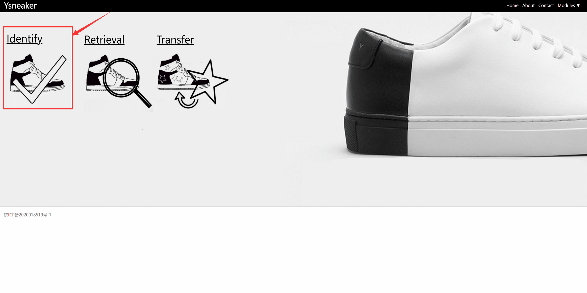
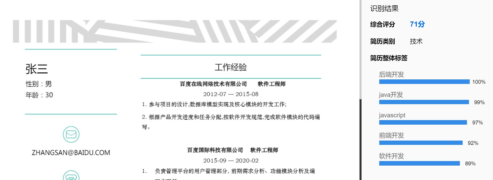
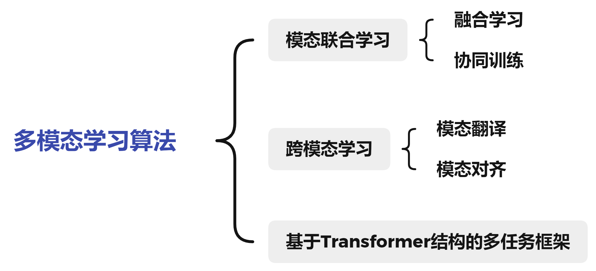

简体中文 | [English](README_en.md)
# PaddleMM

<a href="./LICENSE"></a>
<a href=""></a>
<a href=""></a>
<a href=""></a>
<a href=""></a>

## 简介
多模态学习工具包 PaddleMM 以百度 PaddlePaddle 平台为主，兼容 PyTorch 提供 torch 版本，旨在于提供模态联合学习和跨模态学习算法模型库，为处理图片文本等多模态数据提供高效的解决方案，助力多模态学习应用落地。

PaddleMM 发布作者：
- 南京理工大学 - [PCALAB](http://www.patternrecognition.asia/)实验室 - [KMG小组](http://www.njustkmg.cn/)([杨杨教授](https://cs.njust.edu.cn/63/5b/c11704a222043/page.htm)指导)、[baoran](https://github.com/baoran)
- 百度人才智库（TIC）
- 百度深度学习平台 [Paddle](https://www.paddlepaddle.org.cn/) 部门]

### 近期更新
2022.1.14
- Refactor cross-modal retrieval code and integrate related modules
- Add cross-modal retrieval method IMRAM
- Fixed issues in ContrastiveLoss

[更多](doc/update.md)

## 特性
- 丰富的任务场景：工具包提供多模态融合、跨模态检索、图文生成等多种多模态学习任务算法模型库，支持用户自定义数据和训练。
- 成功的工业应用：基于工具包算法已有相关落地应用，如球鞋真伪鉴定、图像字幕生成、舆情监控等。


### 应用展示
- 球鞋真伪鉴定 (更多信息欢迎访问我们的网站 [Ysneaker](http://www.ysneaker.com/) ！)

<div align=center></div>


- 更多应用

<div align=center></div>


### 落地实践
- 与百度人才智库（TIC）合作 [智能招聘](https://ai.baidu.com/solution/recruitment) 简历分析，基于多模态融合算法成功落地。

<div align=center></div>

## 框架
PaddleMM 包括 paddle 版本 paddlemm 包和 torch 版本 torchmm，由以下三个模块组成：
- 数据处理：提供统一的数据接口和多种数据处理格式
- 模型库：包括多模态融合、跨模态检索、图文生成、多任务算法
- 训练器：对每种任务设置统一的训练流程和相关指标计算

<div align=center></div>

### 使用
下载工具包

```
git clone https://github.com/njustkmg/PaddleMM.git
```

- 数据搭建说明 [教程](data/README.md)
- 依赖文件下载 [教程](paddlemm/metrics/README.md) 

#### paddlemm 使用示例：

```python
from paddlemm import PaddleMM

# config: Model running parameters, see configs/
# data_root: Path to dataset
# image_root: Path to images
# gpu: Which gpu to use

runner = PaddleMM(config='configs/cmml.yml',
                  data_root='data/COCO', 
                  image_root='data/COCO/images', 
                  gpu=0)

runner.train()
runner.test()
```

或者

```
python run.py --config configs/cmml.yml --data_root data/COCO --image_root data/COCO/images --gpu 0
```
#### torchmm 使用示例：

```python
from torchmm import TorchMM

# config: Model running parameters, see configs/
# data_root: Path to dataset
# image_root: Path to images
# cuda: Which gpu to use

runner = TorchMM(config='configs/cmml.yml',
                 data_root='data/COCO', 
                 image_root='data/COCO/images', 
                 cuda=0)

runner.train()
runner.test()
```

或者

```
python run_torch.py --config configs/cmml.yml --data_root data/COCO --image_root data/COCO/images --cuda 0
```


### 模型库 (持续更新中)

<div align=center></div>

- 模态联合学习-融合学习
  - Early (Multi-modal early fusion)
  - Late (Multi-modal late fusion)
- 模态联合学习-协同训练
  - CMML ([Comprehensive Semi-Supervised Multi-Modal Learning](https://www.ijcai.org/proceedings/2019/0568.pdf))
- 跨模态学习-模态翻译
  - ShowAttendTell ([Show, Attend and Tell: Neural Image Caption Generation with Visual Attention](https://arxiv.org/pdf/1502.03044.pdf))
  - AoANet ([Attention on Attention for Image Captioning](https://arxiv.org/pdf/1908.06954.pdf))
- 跨模态学习-模态对齐
  - VSE++ ([VSE++: Improving Visual-Semantic Embeddings with Hard Negatives](https://arxiv.org/pdf/1707.05612.pdf))
  - SCAN ([Stacked Cross Attention for Image-Text Matching](https://arxiv.org/pdf/1803.08024.pdf))
  - IMRAM ([IMRAM: Iterative Matching with Recurrent Attention Memory for Cross-Modal Image-Text Retrieval](https://arxiv.org/pdf/2003.03772.pdf))
  - SGRAF ([Similarity Reasoning and Filtration for Image-Text Matching](https://arxiv.org/pdf/2101.01368.pdf))
- 基于 Transformer 结构的多任务框架
  - VILBERT ([ViLBERT: Pretraining Task-Agnostic Visiolinguistic Representations for Vision-and-Language Tasks](https://arxiv.org/pdf/1908.02265.pdf))
  

## 技术支撑

### 多模态论文

- Chuan Qin, Hengshu Zhu, Tong Xu, Chen Zhu, Liang Jiang, Enhong Chen, Hui Xiong, Enhancing Person-Job Fit for Talent Recruitment: An Ability-aware Neural Network Approach, In Proceedings of the 41st International ACM SIGIR Conference on Research and Development in Information Retrieval (SIGIR-2018) , Ann Arbor, Michigan, USA, 2018.
- Chen Zhu, Hengshu Zhu, Hui Xiong, Chao Ma, Fang Xie, Pengliang Ding, Pan Li, Person-Job Fit: Adapting the Right Talent for the Right Job with Joint Representation Learning, In ACM Transactions on Management Information Systems (ACM TMIS), 2018.
- Dazhong Shen, Hengshu Zhu, Chuan Qin, Tong Xu, Enhong Chen, Hui Xiong, Joint Representation Learning with Relation-enhanced Topic Models for Intelligent Job Interview Assessment, In ACM Transactions on Information Systems (ACM TOIS) , 2021.
- Yang Yang, Jia-Qi Yang, Ran Bao, De-Chuan Zhan, Hengshu Zhu, Xiao-Ru Gao, Hui Xiong, Jian Yang. Corporate Relative Valuation using Heterogeneous Multi-Modal Graph Neural Network. IEEE Transactions on Knowledge and Data Engineering (IEEE TKDE), 2021. (CCF-A). [Code](https://github.com/njustkmg/TKDE21_HMM)
- Yang Yang, De-Chuan Zhan, Yi-Feng Wu, Zhi-Bin Liu, Hui Xiong, and Yuan Jiang. Semi-Supervised Multi-Modal Clustering and Classification with Incomplete Modalities. IEEE Transactions on Knowledge and Data Engineering (IEEE TKDE), 2020. (CCF-A)
- Yang Yang, Chubing Zhang, Yi-Chu Xu, Dianhai Yu, De-Chuan Zhan, Jian Yang. Rethinking Label-Wise Cross-Modal Retrieval from A Semantic Sharing Perspective. Proceedings of the 30th International Joint Conference on Artificial Intelligence (IJCAI-2021), Montreal, Canada, 2021. (CCF-A).
- Yang Yang, Yi-Feng Wu, De-Chuan Zhan, Zhi-Bin Liu, Yuan Jiang. Complex Object Classification: A Multi-Modal Multi-Instance Multi-Label Deep Network with Optimal Transport. Proceedings of the Annual Conference on ACM SIGKDD (KDD-2018) , London, UK, 2018. [Code](https://github.com/njustkmg/KDD18_M3DN)

更多论文欢迎访问我们的网站 [njustkmg](http://www.njustkmg.cn/) ！

### 飞桨论文复现挑战赛

- 飞桨论文复现挑战赛 (第四期)：《Comprehensive Semi-Supervised Multi-Modal Learning》赛题冠军
- [飞桨论文复现挑战赛 (第五期)](https://aistudio.baidu.com/aistudio/competition/detail/126/0/introduction)：《From Recognition to Cognition: Visual Commonsense Reasoning》赛题冠军


## 贡献
- PaddlePaddle 复现代码问题记录 [链接](doc/paddle.md) 。
- 我们非常欢迎您为 PaddleMM 贡献代码，也十分感谢你的反馈。


## 许可证书
本项目的发布受 <a href="LICENSE">Apache 2.0 license</a> 许可认证。
