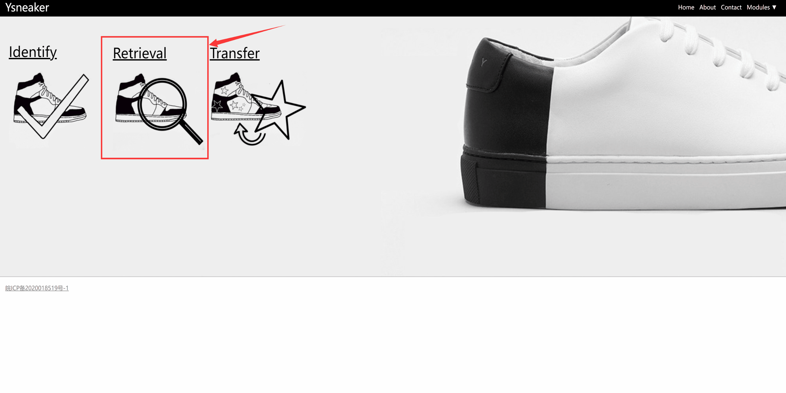
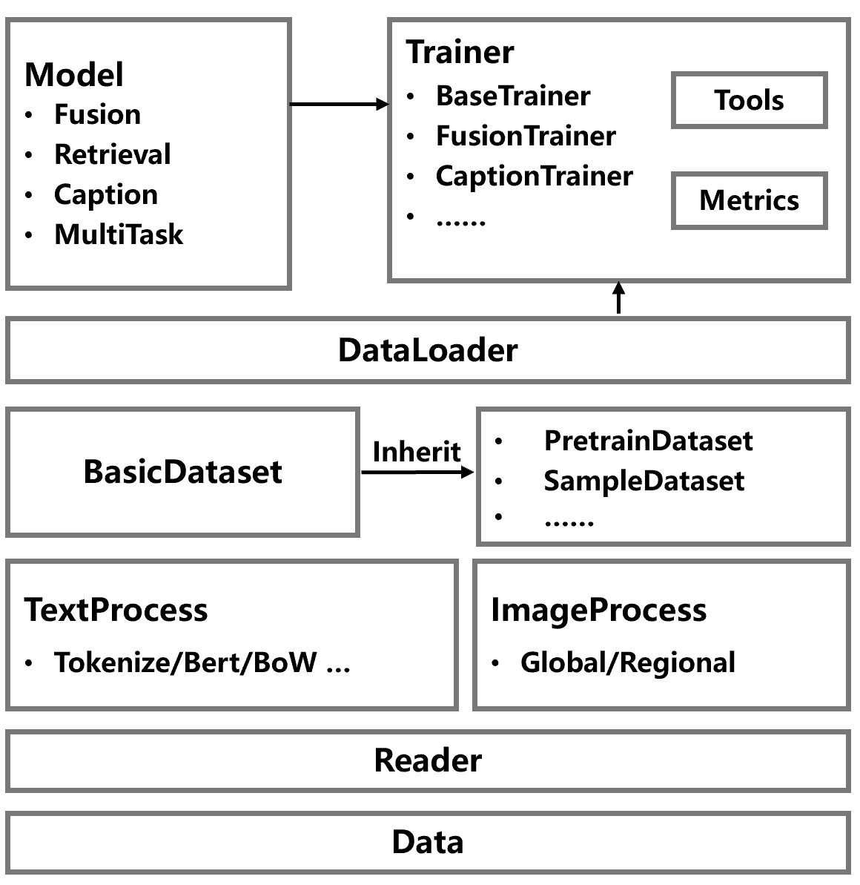
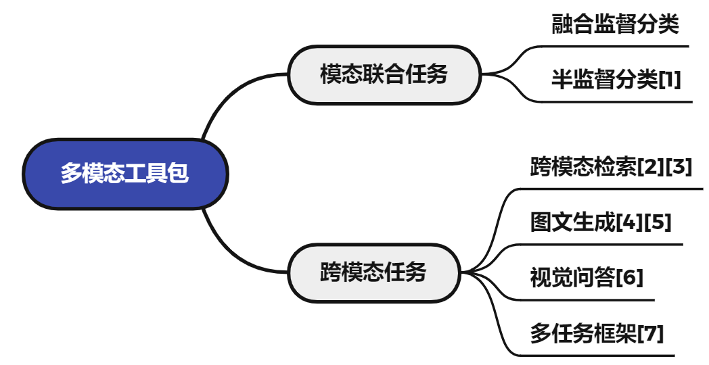

简体中文 | [English](README_en.md)
# PaddleMM

<a href="./LICENSE"></a>
<a href=""></a>
<a href=""></a>
<a href=""></a>
<a href=""></a>

## 简介
飞桨多模态学习工具包 PaddleMM 旨在于提供模态联合学习和跨模态学习算法模型库，为处理图片文本等多模态数据提供高效的解决方案，助力多模态学习应用落地。

### 近期更新
- 2022.1.5 发布 PaddleMM 初始版本 v1.0

## 特性
- 丰富的任务场景：工具包提供多模态融合、跨模态检索、图文生成等多种多模态学习任务算法模型库，支持用户自定义数据和训练。
- 成功的落地实践：基于工具包算法已有相关落地应用，如球鞋真伪鉴定、球鞋风格迁移、家具图片自动描述、舆情监控等。


### 应用展示
- 球鞋真伪鉴定

<div align=center></div>

- 球鞋风格迁移


- 球鞋检索




更多信息欢迎访问我们的网站 [Ysneaker](http://www.ysneaker.com/) ！

## 框架
PaddleMM 包括以下模块：
- 数据处理：提供统一的数据接口和多种数据处理格式
- 模型库：包括多模态融合、跨模态检索、图文生成、多任务算法
- 训练器：对每种任务设置统一的训练流程和相关指标计算



### 使用
下载工具包

```
git clone
```

使用示例：

```python
from paddlemm import PaddleMM

# config: Model running parameters, see configs/
# data_root: Path to dataset
# image_root: Path to images
# gpu: Which gpu to use

runner = PaddleMM(config='configs/cmml.yml',
                  data_root='data/COCO', 
                  image_root='data/COCO/images', 
                  gpu=0)
```

或者

```
python run.py --config configs/cmml.yml --data_root data/COCO --image_root data/COCO/images --gpu 0
```


### 模型库 (更新中)



[1] [Comprehensive Semi-Supervised Multi-Modal Learning](https://www.ijcai.org/proceedings/2019/0568.pdf)

[2] [Stacked Cross Attention for Image-Text Matching](https://arxiv.org/pdf/1803.08024.pdf)

[3] [Similarity Reasoning and Filtration for Image-Text Matching](https://arxiv.org/pdf/2101.01368.pdf)

[4] [Show, Attend and Tell: Neural Image Caption Generation with Visual Attention](https://arxiv.org/pdf/1502.03044.pdf)

[5] [Attention on Attention for Image Captioning](https://arxiv.org/pdf/1908.06954.pdf)

[6] [VQA: Visual Question Answering](https://arxiv.org/pdf/1505.00468.pdf)

[7] [ViLBERT: Pretraining Task-Agnostic Visiolinguistic Representations for Vision-and-Language Tasks](https://arxiv.org/pdf/1908.02265.pdf)


### 实验结果

多模态融合

|               | Average_Precision | Coverage | Example_AUC | Macro_AUC | Micro_AUC | Ranking_loss |             |
| ------------- | ----------------- | -------- | ----------- | --------- | --------- | ------------ | ----------- |
| CMML          | 0.682             | 18.827   | 0.948       | 0.927     | 0.950     | 0.052        |             |
| Early(add)    |                   |          |             |           |           |              | ResNet+LSTM |
| Early(concat) |                   |          |             |           |           |              | ResNet+GRU  |


## 许可证书
本项目的发布受 <a href="">Apache 2.0 license</a> 许可认证。
