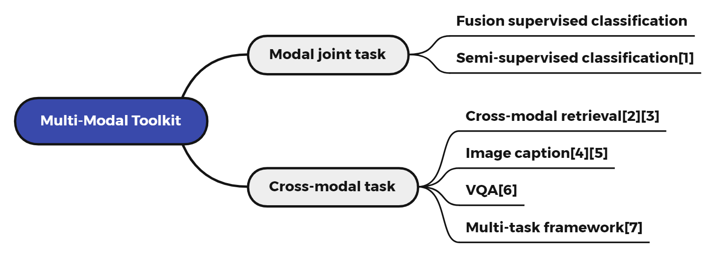

[简体中文](README.md) | English

# PaddleMM

<a href="./LICENSE"></a>
<a href=""></a>
<a href=""></a>
<a href=""></a>
<a href=""></a>

## Introduction
PaddleMM aims to provide modal joint learning and cross-modal learning algorithm model libraries, providing efficient solutions for processing multi-modal data such as images and texts, which promote applications of multi-modal machine learning .

### Recent updates
- 2022.1.5 release PaddleMM v1.0

## Features
- Vast task scenarios: PaddleMM provides a variety of multi-modal learning task algorithm model libraries such as multi-modal fusion, cross-modal retrieval, image caption, and supports user-defined data and training.
- Successful applications: There are related practical applications based on the PaddleMM, such as sneaker authenticity identification, sneaker style migration, automatic description of furniture pictures, rumor detection, etc.


### Visualization 
-  Sneaker authenticity identification

<div align=center></div>
  For more information, please visit our website [Ysneaker](http://www.ysneaker.com/) ！

- more visualization 

### Enterprise Application
- Cooperation with Baidu TIC [Smart Recruitment](https://ai.baidu.com/solution/recruitment) Resume analysis, based on multi-modal fusion algorithm and successfully implemented.

<div align=center></div>

## Framework
PaddleMM include the following modules:
- Data processing: Provide a unified data interface and multiple data processing formats.
- Model library: Including multi-modal fusion, cross-modal retrieval, image caption, and multi-task algorithms.
- Trainer: Set up a unified training process and related score calculations for each task.

<div align=center></div>

### Use
Download the toolkit:

```
git clone https://github.com/njustkmg/PaddleMM.git
```

- Data construction instructions [here](data/README_en.md)
- Dependent files download [here](paddlemm/metrics/README_en.md)

Example:

```python
from paddlemm import PaddleMM

# config: Model running parameters, see configs/
# data_root: Path to dataset
# image_root: Path to images
# gpu: Which gpu to use
runner = PaddleMM(config='configs/cmml.yml',
                  data_root='data/COCO', 
                  image_root='data/COCO/images', 
                  gpu=0)

runner.train()
runner.test()
```

or

```
python run.py --config configs/cmml.yml --data_root data/COCO --image_root data/COCO/images --gpu 0
```


### Model library (updating)

<div align=center></div>

[1] [Comprehensive Semi-Supervised Multi-Modal Learning](https://www.ijcai.org/proceedings/2019/0568.pdf)

[2] [Stacked Cross Attention for Image-Text Matching](https://arxiv.org/pdf/1803.08024.pdf)

[3] [Similarity Reasoning and Filtration for Image-Text Matching](https://arxiv.org/pdf/2101.01368.pdf)

[4] [Show, Attend and Tell: Neural Image Caption Generation with Visual Attention](https://arxiv.org/pdf/1502.03044.pdf)

[5] [Attention on Attention for Image Captioning](https://arxiv.org/pdf/1908.06954.pdf)

[6] [VQA: Visual Question Answering](https://arxiv.org/pdf/1505.00468.pdf)

[7] [ViLBERT: Pretraining Task-Agnostic Visiolinguistic Representations for Vision-and-Language Tasks](https://arxiv.org/pdf/1908.02265.pdf)

### Experimental result on COCO (updating)

- Multimodal fusion

|               | Average_Precision | Coverage | Example_AUC | Macro_AUC | Micro_AUC | Ranking_Loss |                 |
| ------------- | ----------------- | -------- | ----------- | --------- | --------- | ------------ | --------------- |
| CMML          | 0.682             | 18.827   | 0.948       | 0.927     | 0.950     | 0.052        | semi-supervised |
| Early(add)    | 0.974             | 16.681   | 0.969       | 0.952     | 0.968     | 0.031        | VGG+LSTM        |
| Early(add)    | 0.974             | 16.532   | 0.971       | 0.958     | 0.972     | 0.029        | ResNet+GRU      |
| Early(concat) | 0.797             | 16.366   | 0.972       | 0.959     | 0.973     | 0.028        | ResNet+LSTM     |
| Early(concat) | 0.798             | 16.541   | 0.971       | 0.959     | 0.972     | 0.029        | ResNet+GRU      |
| Early(concat) | 0.795             | 16.704   | 0.969       | 0.952     | 0.968     | 0.031        | VGG+LSTM        |
| Late(mean)    | 0.733             | 17.849   | 0.959       | 0.947     | 0.963     | 0.041        | ResNet+LSTM     |
| Late(mean)    | 0.734             | 17.838   | 0.959       | 0.945     | 0.962     | 0.041        | ResNet+GRU      |
| Late(mean)    | 0.738             | 17.818   | 0.960       | 0.943     | 0.962     | 0.040        | VGG+LSTM        |
| Late(mean)    | 0.735             | 17.938   | 0.959       | 0.941     | 0.959     | 0.041        | VGG+GRU         |
| Late(max)     | 0.742             | 17.953   | 0.959       | 0.944     | 0.961     | 0.041        | ResNet+LSTM     |
| Late(max)     | 0.736             | 17.955   | 0.959       | 0.941     | 0.961     | 0.041        | ResNet+GRU      |
| Late(max)     | 0.727             | 17.949   | 0.958       | 0.940     | 0.959     | 0.042        | VGG+LSTM        |
| Late(max)     | 0.737             | 17.983   | 0.959       | 0.942     | 0.959     | 0.041        | VGG+GRU         |

- Image caption

|                  | Bleu-1 | Bleu-2 | Bleu-3 | Bleu-4 | Meteor | Rouge | Cider |
| ---------------- | ------ | ------ | ------ | ------ | ------ | ----- | ----- |
| NIC(paper)       | 71.8   | 50.3   | 35.7   | 25.0   | 23.0   | -     | -     |
| NIC-VGG(ours)    | 69.9   | 52.4   | 37.9   | 27.1   | 23.4   | 51.4  | 84.5  |
| NIC-ResNet(ours) | 72.8   | 56.0   | 41.4   | 30.1   | 25.2   | 53.7  | 95.9  |
| AoANet-CE(paper) | 78.7   | -      | -      | 38.1   | 28.4   | 57.5  | 119.8 |
| AoANet-CE(ours)  | 75.1   | 58.7   | 44.4   | 33.2   | 27.2   | 55.8  | 109.3 |


## Achievement

### Multi-Modal papers

- **Yang Yang**, Chubing Zhang, Yi-Chu Xu, Dianhai Yu, De-Chuan Zhan, Jian Yang. Rethinking Label-Wise Cross-Modal Retrieval from A Semantic Sharing Perspective. **Proceedings of the 30th International Joint Conference on Artificial Intelligence (IJCAI-2021)**, Montreal, Canada, 2021. (CCF-A). 
- **Yang Yang**, Ke-Tao Wang, De-Chuan Zhan, Hui Xiong, Yuan Jiang. Comprehensive Semi-Supervised Multi-Modal Learning. **Proceedings of the 28th International Joint Conference on Artificial Intelligence (IJCAI-2019)** , Macao, China, 2019. [[Pytorch Code\]](https://github.com/njustkmg/IJCAI19_CMML) [[Paddle Code\]](https://github.com/njustkmg/CMML_Paddle)
- **Yang Yang**, Yi-Feng Wu, De-Chuan Zhan, Zhi-Bin Liu, Yuan Jiang. Deep Robust Unsupervised Multi-Modal Network. **Proceedings of the 33rd AAAI Conference on Artificial Intelligence (AAAI-2019)** , Honolulu, Hawaii, 2019.
- **Yang Yang**, Yi-Feng Wu, De-Chuan Zhan, Yuan Jiang. Deep Multi-modal Learning with Cascade Consensus. **Proceedings of the Pacific Rim International Conference on Artificial Intelligence (PRICAI-2018)** , Nanjing, China, 2018.
- **Yang Yang**, Yi-Feng Wu, De-Chuan Zhan, Zhi-Bin Liu, Yuan Jiang. Complex Object Classification: A Multi-Modal Multi-Instance Multi-Label Deep Network with Optimal Transport. **Proceedings of the Annual Conference on ACM SIGKDD (KDD-2018)** , London, UK, 2018. [[Code\]](https://github.com/njustkmg/KDD18_M3DN)
- **Yang Yang**, De-Chuan Zhan, Xiang-Rong Sheng, Yuan Jiang. Semi-Supervised Multi-Modal Learning with Incomplete Modalities. **Proceedings of the 27th International Joint Conference on Artificial Intelligence (IJCAI-2018)** , Stockholm, Sweden, 2018.
- **Yang Yang**, De-Chuan Zhan, Ying Fan, and Yuan Jiang. Instance Specific Discriminative Modal Pursuit: A Serialized Approach. **Proceedings of the 9th Asian Conference on Machine Learning (ACML-2017)** , Seoul, Korea, 2017. **[Best Paper]** [[Code\]](https://github.com/njustkmg/ACML17_DMS)
- **Yang Yang**, De-Chuan Zhan, Xiang-Yu Guo, and Yuan Jiang. Modal Consistency based Pre-trained Multi-Model Reuse. **Proceedings of the 26th International Joint Conference on Artificial Intelligence (IJCAI-2017)** , Melbourne, Australia, 2017.
- **Yang Yang**, De-Chuan Zhan, Yin Fan, Yuan Jiang, and Zhi-Hua Zhou. Deep Learning for Fixed Model Reuse. **Proceedings of the 31st AAAI Conference on Artificial Intelligence (AAAI-2017)**, San Francisco, CA. 2017.
- **Yang Yang**, De-Chuan Zhan and Yuan Jiang. Learning by Actively Querying Strong Modal Features. **Proceedings of the 25th International Joint Conference on Artificial Intelligence (IJCAI-2016)**, New York, NY. 2016, Page: 1033-1039.
- **Yang Yang**, Han-Jia Ye, De-Chuan Zhan and Yuan Jiang. Auxiliary Information Regularized Machine for Multiple Modality Feature Learning. **Proceedings of the 24th International Joint Conference on Artificial Intelligence (IJCAI-2015)**, Buenos Aires, Argentina, 2015, Page: 1033-1039.
- **Yang Yang**, De-Chuan Zhan, Yi-Feng Wu, Zhi-Bin Liu, Hui Xiong, and Yuan Jiang. Semi-Supervised Multi-Modal Clustering and Classification with Incomplete Modalities. **IEEE Transactions on Knowledge and Data Engineering (IEEE TKDE)**, 2020. (CCF-A)
- **Yang Yang**, Zhao-Yang Fu, De-Chuan Zhan, Zhi-Bin Liu, Yuan Jiang. Semi-Supervised Multi-Modal Multi-Instance Multi-Label Deep Network with Optimal Transport. **IEEE Transactions on Knowledge and Data Engineering (IEEE TKDE)**, 2020. (CCF-A)

For more papers, welcome to our website [njustlkmg](http://www.njustkmg.cn/) !

### PaddlePaddle Paper Reproduction Competition 

- Paddle Paper Reproduction Competition (4st): "Comprehensive Semi-Supervised Multi-Modal Learning" Championship
- [Paddle Paper Reproduction Competition (5st)](https://aistudio.baidu.com/aistudio/competition/detail/126/0/introduction): "From Recognition to Cognition: Visual Commonsense Reasoning" Championship


## Contribution

- Thanks very much for the technical and application support provided by Baidu TIC.
- We welcome you to contribute code to PaddleMM, and thank you very much for your feedback.


## License
This project is released under [Apache 2.0 license](LICENSE)
