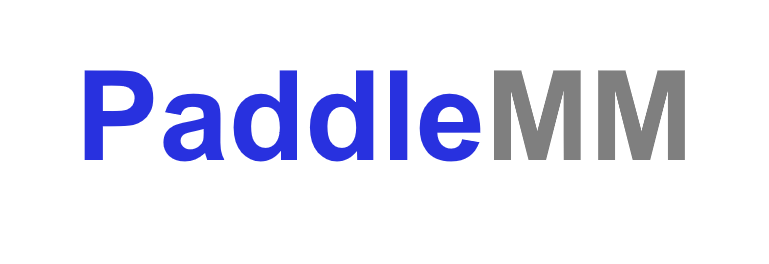
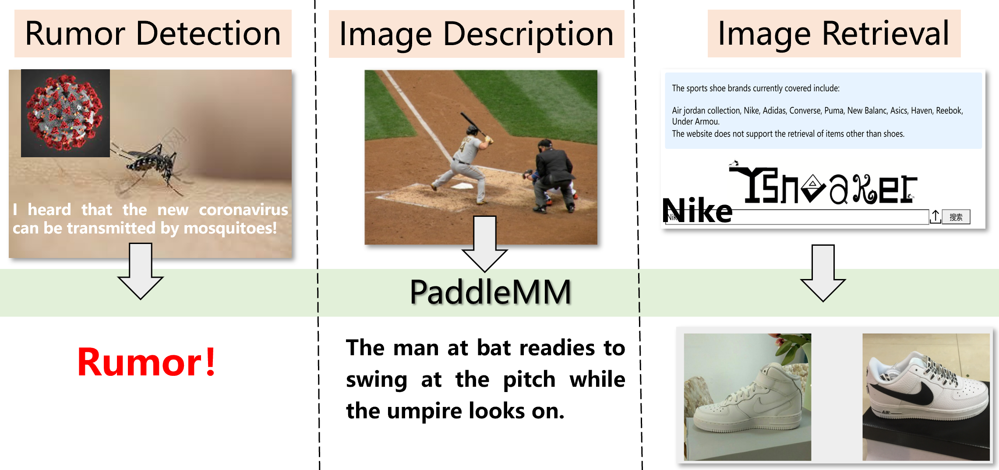
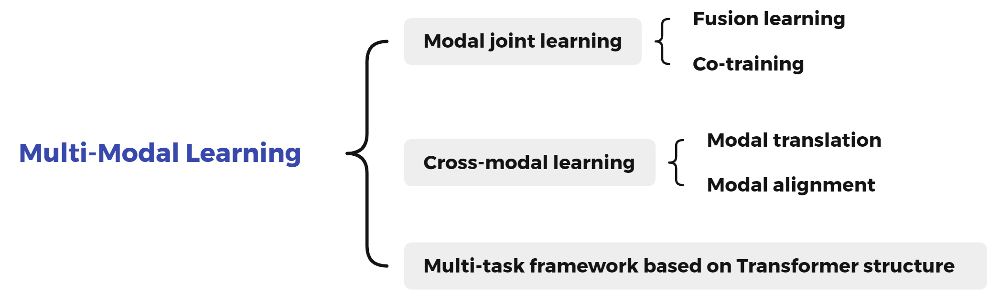

[简体中文](README.md) | English

<div align=center></div>

<a href="./LICENSE"></a>
<a href=""></a>
<a href=""></a>
<a href=""></a>
<a href=""></a>
<a href=""></a>

## Introduction
PaddleMM mainly based on Baidu PaddlePaddle platform, compatible with PyTorch version, aiming to provide modal joint learning and cross-modal learning algorithm model libraries, providing efficient solutions for processing multi-modal data such as images and texts, which promote applications of multi-modal machine learning.

Authors of PaddleMM:
- [NJUST](http://www.njust.edu.cn/)-[PCALAB](http://www.patternrecognition.asia/)-[Prof. Yang Yang](http://www.njustkmg.cn/) and [baoran](https://github.com/baoran)
- Baidu TIC Department
- Baidu Deep Learning Platform [Paddle](https://www.paddlepaddle.org.cn/) Department

### Recent Updates
2022.2.23
- Add model BFAN

[more](doc/update.md)


## Features
- Multiple task scenarios: PaddleMM provides a variety of multi-modal learning task algorithm model libraries such as multi-modal fusion, cross-modal retrieval, image caption, and supports user-defined data and training.
- Successful industrial applications: There are related practical applications based on the PaddleMM, such as sneaker authenticity identification, image description, rumor detection, etc.


### Visualization 
-  Sneaker authenticity identification

<div align=center></div>
  For more information, please visit our website [Ysneaker](http://www.ysneaker.com/) !

- more visualization 

<div align=center></div>


### Enterprise Application
- Cooperation with Baidu TIC [Smart Recruitment](https://ai.baidu.com/solution/recruitment) Resume analysis, based on multi-modal fusion algorithm and successfully implemented.

<div align=center></div>

## Framework
PaddleMM includes the paddle version paddlemm package and the torch version torchmm, which consists of the following three modules:
- Data processing: Provide a unified data interface and multiple data processing formats.
- Model library: Including multi-modal fusion, cross-modal retrieval, image caption, and multi-task algorithms.
- Trainer: Set up a unified training process and related score calculations for each task.

<div align=center></div>

### Use
Download the toolkit:

```
git clone https://github.com/njustkmg/PaddleMM.git
```

- Data construction instructions [here](data/README.md)
- Dependent files download [here](paddlemm/metrics/README.md) 

#### Paddle Example:
```python
from paddlemm import PaddleMM

# config: Model running parameters, see configs/
# data_root: Path to dataset
# image_root: Path to images
# gpu: Which gpu to use

runner = PaddleMM(config='configs/cmml.yml',
                  data_root='data/COCO', 
                  image_root='data/COCO/images', 
                  out_root='experiment/cmml_paddle',
                  gpu=0)

runner.train()
runner.test()
```

或者

```
python run.py --config configs/cmml.yml --data_root data/COCO --image_root data/COCO/images --out_root experiment/cmml_paddle --gpu 0
```

#### Torch Example:

```python
from torchmm import TorchMM

# config: Model running parameters, see configs/
# data_root: Path to dataset
# image_root: Path to images
# cuda: Which gpu to use

runner = TorchMM(config='configs/cmml.yml',
                 data_root='data/COCO', 
                 image_root='data/COCO/images',
                 out_root='experiment/cmml_torch',
                 cuda=0)

runner.train()
runner.test()
```

或者

```
python run_torch.py --config configs/cmml.yml --data_root data/COCO --image_root data/COCO/images --out_root experiment/cmml_torch --cuda 0
```


### Model library (Continuously Updating)

<div align=center></div>

- Modal joint learning - Fusion learning
  - Early (Multi-modal early fusion)
  - Late (Multi-modal late fusion)
- Modal joint learning - Co-training
  - CMML ([Comprehensive Semi-Supervised Multi-Modal Learning](https://www.ijcai.org/proceedings/2019/0568.pdf))
- Cross-modal learning - Modal translation
  - ShowAttendTell ([Show, Attend and Tell: Neural Image Caption Generation with Visual Attention](https://arxiv.org/pdf/1502.03044.pdf))
  - AoANet ([Attention on Attention for Image Captioning](https://arxiv.org/pdf/1908.06954.pdf))
- Cross-modal learning - Modal alignment
  - VSE++ ([VSE++: Improving Visual-Semantic Embeddings with Hard Negatives](https://arxiv.org/pdf/1707.05612.pdf))
  - SCAN ([Stacked Cross Attention for Image-Text Matching](https://arxiv.org/pdf/1803.08024.pdf))
  - BFAN ([Focus Your Attention: A Bidirectional Focal Attention Network for Image-Text Matching](https://dl.acm.org/doi/10.1145/3343031.3350869))
  - IMRAM ([IMRAM: Iterative Matching with Recurrent Attention Memory for Cross-Modal Image-Text Retrieval](https://arxiv.org/pdf/2003.03772.pdf))
  - SGRAF ([Similarity Reasoning and Filtration for Image-Text Matching](https://arxiv.org/pdf/2101.01368.pdf))
- Multi-task framework based on Transformer structure
  - VILBERT ([ViLBERT: Pretraining Task-Agnostic Visiolinguistic Representations for Vision-and-Language Tasks](https://arxiv.org/pdf/1908.02265.pdf))
  


## Achievement

### Multi-Modal papers

- Chuan Qin, Hengshu Zhu, Tong Xu, Chen Zhu, Liang Jiang, Enhong Chen, Hui Xiong, Enhancing Person-Job Fit for Talent Recruitment: An Ability-aware Neural Network Approach, In Proceedings of the 41st International ACM SIGIR Conference on Research and Development in Information Retrieval (SIGIR-2018) , Ann Arbor, Michigan, USA, 2018.
- Chen Zhu, Hengshu Zhu, Hui Xiong, Chao Ma, Fang Xie, Pengliang Ding, Pan Li, Person-Job Fit: Adapting the Right Talent for the Right Job with Joint Representation Learning, In ACM Transactions on Management Information Systems (ACM TMIS), 2018.
- Dazhong Shen, Hengshu Zhu, Chuan Qin, Tong Xu, Enhong Chen, Hui Xiong, Joint Representation Learning with Relation-enhanced Topic Models for Intelligent Job Interview Assessment, In ACM Transactions on Information Systems (ACM TOIS) , 2021.
- Yang Yang, Jia-Qi Yang, Ran Bao, De-Chuan Zhan, Hengshu Zhu, Xiao-Ru Gao, Hui Xiong, Jian Yang. Corporate Relative Valuation using Heterogeneous Multi-Modal Graph Neural Network. IEEE Transactions on Knowledge and Data Engineering (IEEE TKDE), 2021. (CCF-A). [Code](https://github.com/njustkmg/TKDE21_HMM)
- Yang Yang, De-Chuan Zhan, Yi-Feng Wu, Zhi-Bin Liu, Hui Xiong, and Yuan Jiang. Semi-Supervised Multi-Modal Clustering and Classification with Incomplete Modalities. IEEE Transactions on Knowledge and Data Engineering (IEEE TKDE), 2020. (CCF-A)
- Yang Yang, Chubing Zhang, Yi-Chu Xu, Dianhai Yu, De-Chuan Zhan, Jian Yang. Rethinking Label-Wise Cross-Modal Retrieval from A Semantic Sharing Perspective. Proceedings of the 30th International Joint Conference on Artificial Intelligence (IJCAI-2021), Montreal, Canada, 2021. (CCF-A).
- Yang Yang, Yi-Feng Wu, De-Chuan Zhan, Zhi-Bin Liu, Yuan Jiang. Complex Object Classification: A Multi-Modal Multi-Instance Multi-Label Deep Network with Optimal Transport. Proceedings of the Annual Conference on ACM SIGKDD (KDD-2018) , London, UK, 2018. [Code](https://github.com/njustkmg/KDD18_M3DN)

For more papers, welcome to our website [njustkmg](http://www.njustkmg.cn/) !

### PaddlePaddle Paper Reproduction Competition 

- Paddle Paper Reproduction Competition (4st): "Comprehensive Semi-Supervised Multi-Modal Learning" Championship
- [Paddle Paper Reproduction Competition (5st)](https://aistudio.baidu.com/aistudio/competition/detail/126/0/introduction): "From Recognition to Cognition: Visual Commonsense Reasoning" Championship


## Contribution
- PaddlePaddle reproduce record. [link](doc/paddle.md) .
- We welcome you to contribute code to PaddleMM, and thank you very much for your feedback.


## License
This project is released under [Apache 2.0 license](LICENSE) .
